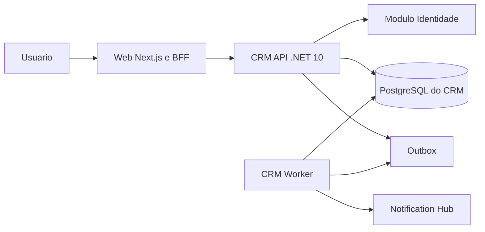

# Arquitetura Tecnica

## Visao geral

O LavaMais CRM sera desenvolvido em um monorepo com tres aplicacoes implantaveis e um banco exclusivo:

## Componentes

### Web

- Next.js, React e TypeScript;
- interface e BFF no mesmo deploy;
- sessao segura com tokens fora do JavaScript do navegador;
- chamadas empresariais encaminhadas para a API.

### API

- ASP.NET Core com .NET 10;
- monolito modular;
- OpenAPI versionada em `/api/v1`;
- validacao da sessao opaca emitida pelo modulo Identidade;
- regras de dominio e persistencia do CRM.

### Worker

- processo .NET separado usando os mesmos modulos de aplicacao;
- consome a outbox;
- solicita notificacoes ao Notification Hub;
- reconcilia estados pendentes;
- executara futuras importacoes e integracoes demoradas.

### Banco

- PostgreSQL exclusivo do CRM;
- Entity Framework Core;
- schemas logicos por modulo;
- migrations versionadas e aplicadas em etapa controlada de deploy.

## Documentos

- [Stack definida](arquitetura/01-stack-sugerida.md)
- [Modulos e dependencias](arquitetura/02-modulos-e-dependencias.md)
- [Multitenancy e seguranca](arquitetura/03-multitenancy-e-seguranca.md)
- [Modelo de dados](banco-dados/README.md)
- [Superficie da API](apis/README.md)
- [Identidade visual e padrao de imagens do CRM](frontend/identidade-visual.md)
- [Identidade local](../../10-decisoes/ADR-011-identidade-local-do-crm.md)
- [Notification Hub](integracoes/notification-hub.md)
- [Hybex e Essence GO Industrial](integracoes/hybex-essence-go.md)

## Restricoes atuais

- sem microsservicos internos;
- sem Kafka, Redis ou Kubernetes;
- sem banco compartilhado com os hubs;
- sem acesso direto ao banco de outro sistema;
- sem scraping do Essence GO Industrial;
- sem credenciais externas no frontend.
