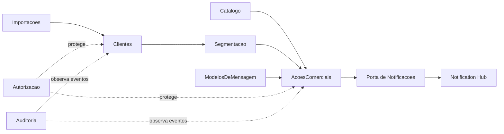

# Modulos e Dependencias

## Modulos iniciais

| Modulo | Responsabilidade |
|---|---|
| `Clientes` | cadastro, contatos, enderecos, etiquetas e permissoes |
| `Catalogo` | produtos e servicos oferecidos |
| `Segmentacao` | criterios, simulacao e elegibilidade |
| `ModelosDeMensagem` | modelos comerciais e versoes publicadas |
| `AcoesComerciais` | fluxo, audiencia, envios e resultados |
| `Importacoes` | entrada de clientes por CSV |
| `Autorizacao` | papeis especificos do CRM |
| `Auditoria` | registro imutavel de eventos sensiveis |
| `Integracoes` | adaptadores para servicos externos |

## Relacoes permitidas



As setas representam contratos de aplicacao, nao acesso a tabelas ou entidades internas.

## Estrutura interna

Cada modulo possui:

```text
Modulo/
├── Dominio/
├── Aplicacao/
├── Infraestrutura/
└── Api/
```

- `Dominio` nao depende de ASP.NET Core, EF Core ou provedores.
- `Aplicacao` coordena casos de uso e portas.
- `Infraestrutura` implementa persistencia e adaptadores.
- `Api` expoe endpoints e traduz contratos HTTP.

## Persistencia entre modulos

- um `DbContext` por modulo, usando a mesma conexao PostgreSQL;
- schemas separados;
- sem propriedades de navegacao EF entre modulos;
- referencias externas ao modulo sao IDs e snapshots necessarios ao historico;
- integridade entre modulos e validada por contratos de aplicacao;
- transacoes que alteram um unico agregado permanecem no modulo proprietario;
- efeitos externos sao publicados pela outbox.

## Extracao futura

Separar um modulo em servico so sera considerado quando houver necessidade concreta de escala, isolamento operacional, ciclo de deploy ou equipe independente. A separacao exige ADR proprio.
