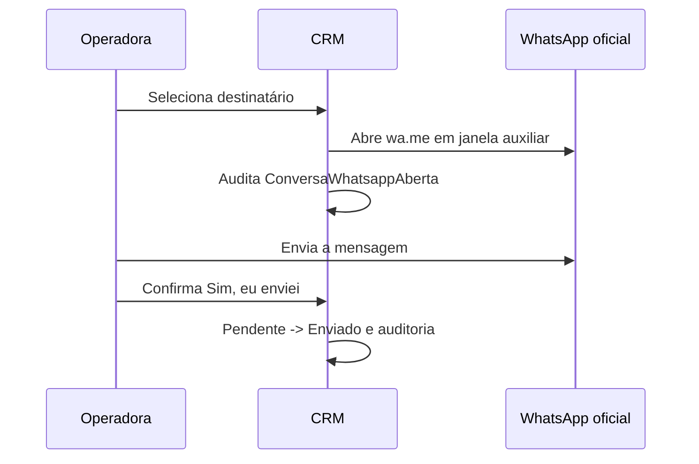

# WhatsApp Web assistido

## Arquitetura vigente

O CRM não integra com uma API de mensagens. A interação acontece no frontend:



## Link

```text
https://wa.me/{telefoneSomenteDigitos}?text={encodeURIComponent(mensagem)}
```

O telefone e o texto vêm do snapshot congelado da ação. A janela usa o nome `lavamais-whatsapp-web` para ser reutilizada durante a fila. Se `window.open` retornar `null`, a interface exibe um link seguro em nova aba.

## API interna do CRM

```text
POST /api/v1/acoes-comerciais/{acaoId}/destinatarios/{destinatarioId}/abrir-whatsapp
POST /api/v1/acoes-comerciais/{acaoId}/destinatarios/{destinatarioId}/confirmar-envio-whatsapp
```

Ambos recebem `{ "versao": numero }` e exigem a política de envio individual. A primeira rota apenas audita. A segunda altera o agregado, registra usuário e horário e retorna o destinatário atualizado.

## Persistência

`acoes_comerciais.destinatarios_da_acao` mantém:

- `situacao_envio`: `Pendente` ou `Enviado`;
- `data_envio_confirmado`;
- `usuario_envio_confirmado_id`;
- snapshot de nome, telefone e conteúdo;
- resultado comercial e sua auditoria;
- `xmin` para concorrência.

Não existem tabela de notificações, fila, identificador de provedor, tentativas, webhook ou reconciliação.

## Iframe

`web.whatsapp.com` publica uma política `frame-ancestors` que impede seu uso dentro de um `iframe` de outro domínio. O CRM usa janela auxiliar; não tenta contornar a proteção.

## Sessão

O WhatsApp decide quando mostrar QR Code e quando desvincular o dispositivo. Cookies e sessão ficam fora do CRM. Nenhuma rotina de saúde do CRM deve interpretar a disponibilidade do WhatsApp Web.

## Migração

O projeto `Modulos/Integracoes` permanece vazio somente para executar a migration que remove as tabelas antigas. Ele não é carregado pela API.
